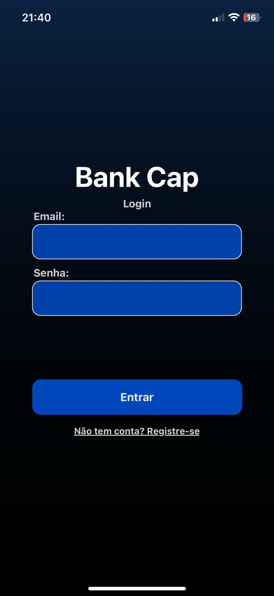
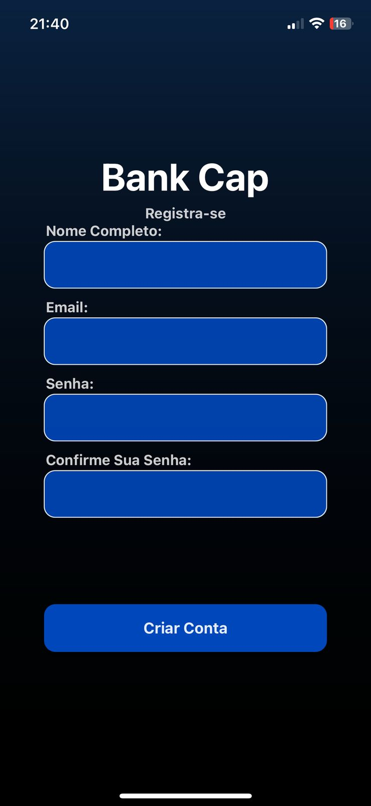

# **🏦 BANK CAP - CONTROLE FINANCEIRO**  
## 🚧🚀 PROJETO EM DESENVOLVIMENTO  

**Bank Cap** é um aplicativo completo de **gestão financeira para pessoas físicas**, permitindo o controle de **receitas, despesas e investimentos em criptomoedas**.  

---

# 📸 PRÉVIA DO APLICATIVO  

## 🏠 Tela de Início  
  

## 🔐 Tela de Login  
  

## 📝 Tela de Registro  
 

> ⚠️ **O projeto ainda está em desenvolvimento!**  
> *Novas telas e funcionalidades serão adicionadas em breve.*  

---

# 🚀🔥 TECNOLOGIAS UTILIZADAS  

### 🖥️ BACK-END  
✅ **Flask (Python)** – API principal  
✅ **JWT (JSON Web Token)** – **Autenticação segura**  
✅ **OAuth 2.0** – **Autenticação com Google**  
✅ **MySQL** – **Banco de dados**  
✅ **SQLAlchemy** – ORM  
✅ **Flask-RESTful** – Organização da API  
✅ **Flask-CORS** – Integração com o front-end  

### 📱 FRONT-END  
✅ **React Native (Expo + TypeScript)**  
✅ **Fetch** – Consumo de API  
✅ **React Navigation** – Gerenciamento de rotas  
✅ **Styled Components** – Estilização  

---

# 🔐 AUTENTICAÇÃO E SEGURANÇA  

✅ **JWT (JSON Web Token)** para proteger o acesso ao sistema  
✅ **Criptografia de senha** para maior segurança  
✅ **Proteção de rotas no front-end**

✅ **OAuth 2.0** – **Autenticação com Google**  
⏳ *Próximas melhorias: recuperação de senha*  

---

# 🚀✨ FUNCIONALIDADES EM DESENVOLVIMENTO  

🔹 📊 **Dashboard financeiro interativo**  
🔹 💰 **Cadastro de receitas e despesas**  
🔹 📈 **Integração com Binance API para criptomoedas**  
🔹 🏢 **Funcionalidades para empresas**  

---

# 📞 CONTATO  

👨‍💻 **Desenvolvedor:** **Gabriel**  
